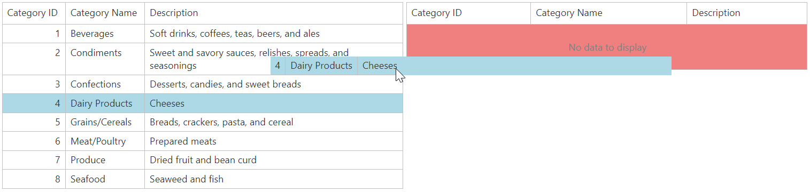

<!-- default badges list -->

[](https://supportcenter.devexpress.com/ticket/details/E1810)
[](https://docs.devexpress.com/GeneralInformation/403183)
[](#does-this-example-address-your-development-requirementsobjectives)
<!-- default badges end -->
# Grid View for ASP.NET Web Forms - How to use jQuery to drag and drop items from one grid to another

This example demonstrates how to use the jQuery framework to drag rows from one grid to another.



## Overview

Create a callback panel and populate it with grid controls. Use jQuery UI [Draggable](http://jqueryui.com/draggable/) and [Droppable](http://jqueryui.com/droppable/) plug-ins and define `draggable` and `droppable` items.

```aspx
<Styles>
    <Table CssClass="droppableLeft"></Table>
    <Row CssClass="draggableRow left"></Row>
</Styles>
```

Add the [ASPxGlobalEvents]() control to the page and handle its client-side [ControlsInitialized]() and [EndCallback]() events. In the handlers, use the corresponding jQuery selectors to initialize the specifed `draggable` and `droppable` items. Use the `start` event handler to obtain the dragged row's key value and apply style settings to that row based on a condition.

```js
start: function (ev, ui) {
    var $sourceElement = $(ui.helper.context);
    var $draggingElement = $(ui.helper);
    // Style elements
    $sourceElement.addClass("draggingStyle");
    $draggingElement.addClass("draggingStyle");
    // Find the row's key value
    var sourceGrid = ASPxClientGridView.Cast($draggingElement.hasClass("left") ? "gridFrom" : "gridTo");
    rowKey = sourceGrid.GetRowKey($sourceElement.index() - 1);
}
```

Handle the `drop` event of the `droppable` items to send a callback to the callback panel to configure the grid's edit functionality.

## Files to Review

* [Default.aspx](./CS/Default.aspx) (VB: [Default.aspx](./VB/Default.aspx))
* [Default.aspx.cs](./CS/Default.aspx.cs) (VB: [Default.aspx.vb](./VB/Default.aspx.vb))
* [script.js](./CS/script.js) (VB: [script.js](./VB/script.js))

## More Examples

* [Grid View for ASP.NET Web Forms - Reorder Grid Rows Using Buttons and Drag-and-Drop](https://github.com/DevExpress-Examples/asp-net-web-forms-grid-reorder-rows-using-buttons-or-drag-and-drop)
* [Grid View for ASP.NET MVC - How to use jQuery to drag and drop items from one grid to another](https://github.com/DevExpress-Examples/gridview-how-to-drag-and-drop-items-from-one-grid-to-another-t116869)
<!-- feedback -->
## Does this example address your development requirements/objectives?

[](https://www.devexpress.com/support/examples/survey.xml?utm_source=github&utm_campaign=asp-net-web-forms-grid-use-jquery-to-drag-and-drop-rows&~~~was_helpful=yes) [](https://www.devexpress.com/support/examples/survey.xml?utm_source=github&utm_campaign=asp-net-web-forms-grid-use-jquery-to-drag-and-drop-rows&~~~was_helpful=no)

(you will be redirected to DevExpress.com to submit your response)
<!-- feedback end -->
